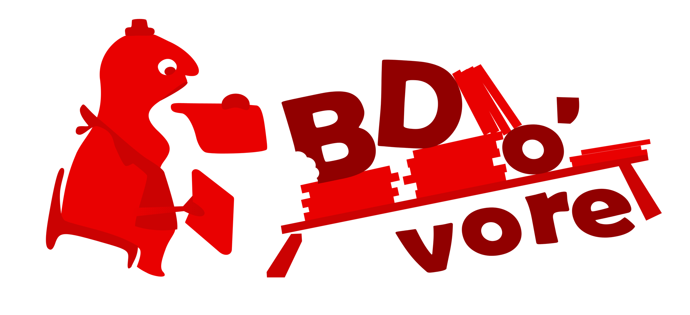

# BDovore client for mobile devices

Coded by Joachim Pouderoux, 2021

License: BSD-3-Clause License

Open-source code hosted on [github](https://github.com/jpouderoux/bdovore).

[BDovore](https://www.bdovore.com) is a free comics management service.

This project aims to provide a free and opensource mobile application for both Android and iOS platforms using a unique technology (React Native) and code base.

This application is available on the following app stores:
 - [Google Play Store](https://play.google.com/store/apps/details?id=com.PaulOlivier.bdovore)
 - [Apple App Store](https://apps.apple.com/fr/app/bdovore/id1519677181)
